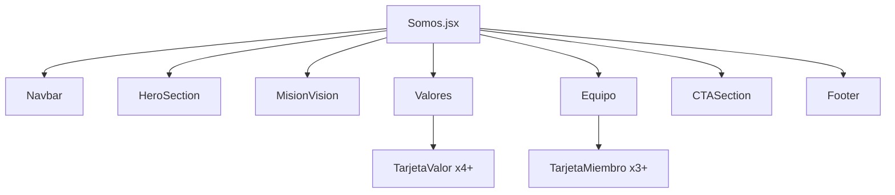

# Documento de Diseño Técnico — Quiénes Somos

## Visión General

La página "Quiénes Somos" (`/somos`) de Fronthers es una sección corporativa que comunica la identidad, valores, equipo y propuesta de valor de la agencia. El archivo `src/pages/Somos.jsx` existe pero está casi vacío. Este diseño describe cómo transformarlo en una página completa, estructurada y visualmente coherente con el resto del sitio.

El stack es React 19 + Vite, Bootstrap 5 (ya importado en `main.jsx`), React Router DOM v7 y Bootstrap Icons (disponible vía CDN en `index.html`). No se requieren dependencias adicionales.

---

## Arquitectura

La página sigue el mismo patrón que el resto del sitio: un componente de página (`Somos.jsx`) que compone secciones internas y reutiliza los componentes compartidos `Navbar` y `Footer`.



Todas las secciones se implementan directamente dentro de `Somos.jsx` como bloques JSX. No se crean archivos de componentes separados, ya que son específicos de esta página y no se reutilizan en otras partes del sitio.

Los datos estáticos (equipo, valores) se definen como arrays de constantes en la parte superior del archivo, antes del componente.

---

## Componentes e Interfaces

### `Somos` (componente principal)

**Archivo:** `src/pages/Somos.jsx`

Renderiza todas las secciones en orden. No recibe props. Importa `Navbar`, `Footer` y `Somos.css`.

```jsx
const Somos = () => (
  <>
    <Navbar />
    <HeroSection />
    <MisionVision />
    <Valores />
    <Equipo />
    <CTASection />
    <Footer />
  </>
)
```

### Sección Hero

Bloque de cabecera con imagen de fondo (o degradado oscuro), título y subtítulo. Implementado como JSX inline dentro de `Somos.jsx`.

- Clase contenedora: `hero-somos` (definida en `Somos.css`)
- `min-height: 60vh`
- Texto centrado, color blanco
- Padding-top para compensar el Navbar `fixed-top` (~70px)

### Sección Misión y Visión

Dos columnas Bootstrap (`col-12 col-md-6`) dentro de un `row`. Cada columna contiene un ícono Bootstrap Icons, un título (`h3`) y un párrafo.

### Sección Valores

Array de datos `VALORES` con 4 ítems. Cada ítem se renderiza como una `TarjetaValor` inline. Grid: `col-12 col-sm-6 col-lg-3`.

Estructura de cada ítem del array:
```js
{ icon: 'bi-lightbulb', titulo: 'Innovación', descripcion: '...' }
```

### Sección Equipo

Array de datos `EQUIPO` con 3 ítems. Cada ítem se renderiza como una `TarjetaMiembro` inline. Grid: `col-12 col-sm-6 col-md-4`.

Estructura de cada ítem del array:
```js
{ nombre: 'Nombre Apellido', rol: 'Desarrollador Frontend', foto: null }
```

Cuando `foto` es `null` o la imagen falla al cargar, se muestra un avatar genérico usando el ícono `bi-person-circle` de Bootstrap Icons.

### Sección CTA

Bloque con fondo de color diferenciado, título motivador y un `<Link to="/contactos">` de React Router DOM envuelto en un botón Bootstrap.

---

## Modelos de Datos

Los datos son estáticos y se definen como constantes en `Somos.jsx`:

```js
const VALORES = [
  { id: 1, icon: 'bi-lightbulb-fill',   titulo: 'Innovación',    descripcion: 'Buscamos soluciones creativas y modernas para cada proyecto.' },
  { id: 2, icon: 'bi-shield-check',     titulo: 'Confianza',     descripcion: 'Construimos relaciones sólidas basadas en transparencia.' },
  { id: 3, icon: 'bi-people-fill',      titulo: 'Colaboración',  descripcion: 'Trabajamos en equipo con nuestros clientes en cada etapa.' },
  { id: 4, icon: 'bi-rocket-takeoff',   titulo: 'Compromiso',    descripcion: 'Entregamos resultados de calidad dentro de los plazos acordados.' },
];

const EQUIPO = [
  { id: 1, nombre: 'Miembro Uno',  rol: 'Desarrollador Full Stack', foto: null },
  { id: 2, nombre: 'Miembro Dos',  rol: 'Diseñador UI/UX',          foto: null },
  { id: 3, nombre: 'Miembro Tres', rol: 'Desarrollador Frontend',   foto: null },
];
```

---

## Propiedades de Corrección

*Una propiedad es una característica o comportamiento que debe mantenerse verdadero en todas las ejecuciones válidas del sistema — esencialmente, una declaración formal sobre lo que el sistema debe hacer. Las propiedades sirven como puente entre las especificaciones legibles por humanos y las garantías de corrección verificables por máquinas.*

Esta feature involucra renderizado de listas a partir de arrays de datos, lo que hace que PBT sea aplicable para las secciones de Valores y Equipo: el comportamiento varía con el contenido del array, y ejecutar 100 iteraciones con datos generados aleatoriamente puede revelar casos borde (arrays vacíos, campos nulos, caracteres especiales).

### Propiedad 1: Renderizado completo de tarjetas de valores

*Para cualquier* array de valores con N ítems (N ≥ 1), el componente de la sección Valores debe renderizar exactamente N tarjetas `TarjetaValor`.

**Valida: Requisito 3.1**

### Propiedad 2: Estructura completa de TarjetaValor

*Para cualquier* objeto de valor con campos `icon`, `titulo` y `descripcion`, la tarjeta renderizada debe contener los tres elementos visibles: el ícono, el título y la descripción.

**Valida: Requisito 3.2**

### Propiedad 3: Renderizado completo de tarjetas de equipo

*Para cualquier* array de miembros con N ítems (N ≥ 1), el componente de la sección Equipo debe renderizar exactamente N tarjetas `TarjetaMiembro`.

**Valida: Requisito 4.1**

### Propiedad 4: Estructura completa de TarjetaMiembro con datos válidos

*Para cualquier* objeto de miembro con campos `nombre`, `rol` y `foto` no nulos, la tarjeta renderizada debe contener el nombre, el rol y una imagen con la URL de foto proporcionada.

**Valida: Requisito 4.2**

### Propiedad 5: Fallback de avatar para foto ausente

*Para cualquier* objeto de miembro donde el campo `foto` sea `null`, `undefined` o una cadena vacía, la tarjeta renderizada debe mostrar el elemento de avatar genérico en lugar de una imagen rota.

**Valida: Requisito 4.5**

> **Reflexión de propiedades:** Las propiedades 1 y 3 son análogas pero sobre secciones distintas (Valores vs Equipo), por lo que ambas aportan valor único. Las propiedades 2 y 4 también son análogas pero sobre tipos de datos distintos. La propiedad 5 es independiente y cubre un caso de error específico. No hay redundancia entre ellas.

---

## Manejo de Errores

| Caso | Comportamiento esperado |
|------|------------------------|
| `foto` de miembro es `null` o `undefined` | Mostrar ícono `bi-person-circle` como avatar genérico |
| Error de carga de imagen (`onError`) | Reemplazar `src` con avatar genérico vía handler `onError` |
| Array `EQUIPO` o `VALORES` vacío | La sección renderiza sin tarjetas (no rompe la página) |
| Ruta `/contactos` no disponible | React Router maneja el 404; el `<Link>` navega correctamente |

El handler de error de imagen en `TarjetaMiembro`:
```jsx
 { e.target.src = AVATAR_FALLBACK; }}
  alt={nombre}
  className="rounded-circle"
/>
```

Donde `AVATAR_FALLBACK` puede ser una URL de placeholder o un SVG inline.

---

## Estrategia de Testing

### Enfoque dual

Se combinan tests de ejemplo (para comportamientos específicos y estructurales) con tests basados en propiedades (para las secciones que renderizan listas de datos variables).

### Librería de PBT

Para los tests de propiedades se usa **[fast-check](https://fast-check.dev/)** con **Vitest** como runner (consistente con el stack Vite del proyecto).

```bash
npm install --save-dev fast-check vitest @testing-library/react @testing-library/jest-dom jsdom
```

### Tests de ejemplo (Vitest + React Testing Library)

Cubren los criterios de aceptación estructurales y de contenido fijo:

- Verificar que `<Navbar>` y `<Footer>` están presentes en el DOM
- Verificar que el Hero renderiza el título "¿Quiénes Somos?" y un subtítulo
- Verificar que la sección Hero tiene la clase `hero-somos` con `min-height: 60vh`
- Verificar que la sección Misión/Visión tiene dos columnas con íconos, títulos y párrafos
- Verificar que la sección Valores tiene un título de sección visible
- Verificar que cada `TarjetaValor` tiene clase `col-12 col-sm-6 col-lg-3`
- Verificar que cada `TarjetaMiembro` tiene clase `col-12 col-sm-6 col-md-4`
- Verificar que la imagen del miembro tiene clase `rounded-circle`
- Verificar que el CTA contiene un `<Link to="/contactos">`
- Verificar que el primer bloque de contenido tiene `padding-top` suficiente

### Tests de propiedades (fast-check)

Cada test corre mínimo 100 iteraciones. Cada test referencia su propiedad de diseño en un comentario.

```js
// Feature: quienes-somos, Propiedad 1: Renderizado completo de tarjetas de valores
test('renderiza exactamente N tarjetas para cualquier array de valores', () => {
  fc.assert(fc.property(
    fc.array(fc.record({ id: fc.nat(), icon: fc.string(), titulo: fc.string(), descripcion: fc.string() }), { minLength: 1 }),
    (valores) => {
      const { getAllByTestId } = render(<SeccionValores valores={valores} />);
      expect(getAllByTestId('tarjeta-valor')).toHaveLength(valores.length);
    }
  ), { numRuns: 100 });
});

// Feature: quienes-somos, Propiedad 2: Estructura completa de TarjetaValor
test('cada tarjeta de valor muestra ícono, título y descripción', () => {
  fc.assert(fc.property(
    fc.record({ icon: fc.string(), titulo: fc.string({ minLength: 1 }), descripcion: fc.string({ minLength: 1 }) }),
    (valor) => {
      const { getByText, container } = render(<TarjetaValor {...valor} />);
      expect(getByText(valor.titulo)).toBeInTheDocument();
      expect(getByText(valor.descripcion)).toBeInTheDocument();
      expect(container.querySelector('i')).toBeInTheDocument();
    }
  ), { numRuns: 100 });
});

// Feature: quienes-somos, Propiedad 3: Renderizado completo de tarjetas de equipo
test('renderiza exactamente N tarjetas para cualquier array de miembros', () => {
  fc.assert(fc.property(
    fc.array(fc.record({ id: fc.nat(), nombre: fc.string(), rol: fc.string(), foto: fc.option(fc.webUrl()) }), { minLength: 1 }),
    (equipo) => {
      const { getAllByTestId } = render(<SeccionEquipo equipo={equipo} />);
      expect(getAllByTestId('tarjeta-miembro')).toHaveLength(equipo.length);
    }
  ), { numRuns: 100 });
});

// Feature: quienes-somos, Propiedad 5: Fallback de avatar para foto ausente
test('muestra avatar genérico cuando foto es null/undefined/vacío', () => {
  fc.assert(fc.property(
    fc.record({
      nombre: fc.string({ minLength: 1 }),
      rol: fc.string({ minLength: 1 }),
      foto: fc.oneof(fc.constant(null), fc.constant(undefined), fc.constant(''))
    }),
    (miembro) => {
      const { getByAltText } = render(<TarjetaMiembro {...miembro} />);
      const img = getByAltText(miembro.nombre);
      expect(img.src).toContain('avatar');
    }
  ), { numRuns: 100 });
});
```

### Archivos de test

```
src/
  pages/
    __tests__/
      Somos.example.test.jsx   # Tests de ejemplo
      Somos.property.test.jsx  # Tests de propiedades (fast-check)
```
